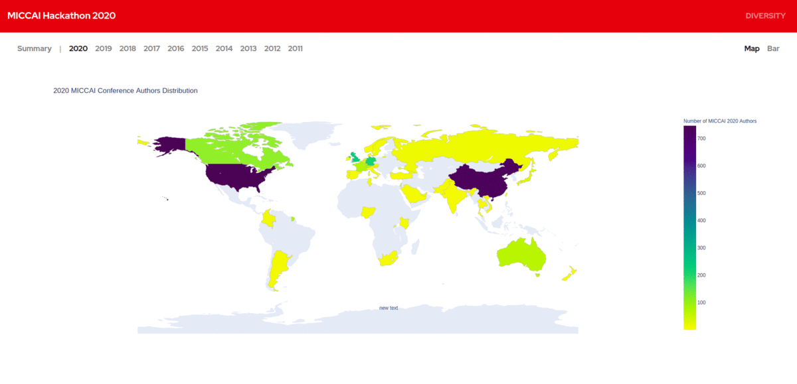

  
  

  <h2 align="center">Geographical Diversity: Insights from MICCAI 2011 - 2020</h2>

  
 
  Diseases impact everyone, but not in the same way. Biological features, disease risk,
and drug efficiency can vary across individuals. Different populations have different
trends in diseases.
Most of the biomedical research is happening in the developed, high incoming
countries, and much of what we know doesn’t apply to ethnic minorities and countries
whose population is underrepresented in medical research. The research community
must do better in addressing this geographical bias.
We were curious about the geographical distribution of MICCAI authors based on their
home institutions, and hence this empirical study. 
  

   
  
  
View our visualizations here: <a href="https://v15hv4.github.io/MICCAI-Hackathon-2020/">https://v15hv4.github.io/MICCAI-Hackathon-2020/</a>

