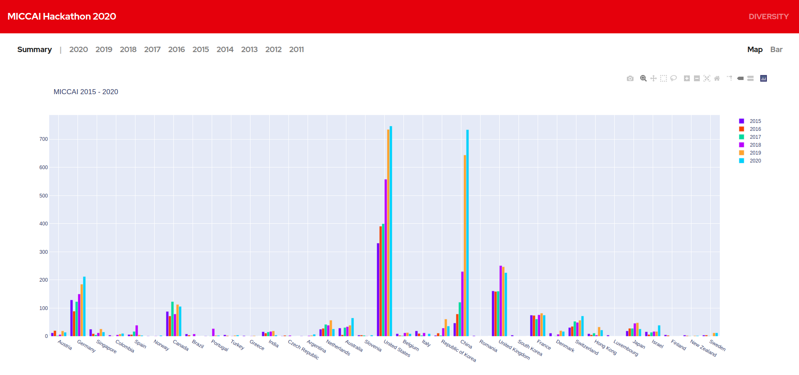

  
  

  <h2 align="center">Geographical Diversity: Insights from MICCAI 2011 - 2020</h2>

  
 
  Diseases impact everyone, but not in the same way. Biological features, disease risk,
and drug efficiency can vary across individuals. Different populations have different
trends in diseases.
Most of the biomedical research is happening in the developed, high incoming
countries, and much of what we know doesn’t apply to ethnic minorities and countries
whose population is underrepresented in medical research. The research community
must do better in addressing this geographical bias.
We were curious about the geographical distribution of MICCAI authors based on their
home institutions, and hence this empirical study. 
  

   
  
  
View our visualizations here: <a href="https://v15hv4.github.io/MICCAI-Hackathon-2020/">https://v15hv4.github.io/MICCAI-Hackathon-2020/</a>

 

<h4>Why is diversity important in research workforce?</h4>

Diversity means more than simply putting together diverse research teams. The
questions they ask and the methods they use to reach scientific insights are quite
different in a truly diverse ecosystem.
As more women entered medical research in the United States in the 1980s and 1990s,
researchers paid greater attention to women’s health issues such as heart disease,
breast cancer and autoimmune diseases.

Different countries and regions have different issues - in people, in infrastructure, and in
public policies, and in almost everything. Local problems require local solutions. An
obsolete technology in a developed country might be a boon to people in low income
countries. 

 

<h4>What did we do during the hackathon?</h4>

We created a database of MICCAI authors from 2011 - 2020 along with the details of their home institutions. We visualized the geographic diversity of authors based on their home institutions and made them <strong>publicly available</strong>. It provides us great insights into how the field is growing and how it is embraced in developing countries in recent years. We are more interested to work on it further and bring in even more insights. 

China had only around 30 researchers publishing at MICCAI in 2011.Today they have over 700 authors. We lately find increased research contributions in MICCAI from South America and Africa. All this information is really interesting. 

 

<h4>What can we do to increase geographical diversity?</h4>

The field of medical image computing has picked the pace in recent years. The number of researchers working in this area is very less when compared to say natural image processing and computer vision.

It is very important to increase the awareness of endless possibilities available and the promise of machine intelligence in healthcare.
One such idea is to create a network of students and professors in different countries teaching and working in the related fields of medical image analysis like computer vision, and image processing and encourage them to work on the problems in the specific area of medical images. Topics in medical computer vision can be included in the curicullum, and course projects, and a MICCAI sub-body can collect such resources and make it available for the public similar to the Educational Challenge. MICCAI can provide incentives to the best submissions. In this way, we can also crowdsource resources and increase the educational content including codes available online for young students. For this to happen, we must bring work with all such people, provide them educational resources related to medical imaging, and give them access to related datasets.

We think creating awareness is the first step in expanding research in the area of medical image computing. 

